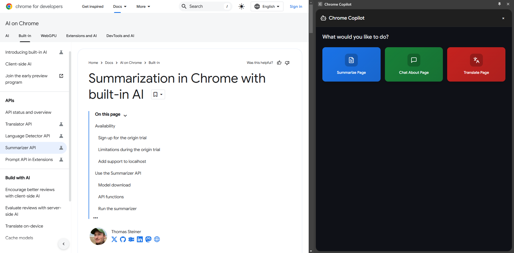

# Chrome Copilot

Chrome Copilot is a browser extension that enhances your browsing experience with AI-powered assistance. It allows you to chat about webpage content, summarize tabs, and get contextual help while browsing.

## Features

- 🤖 AI-powered chat interface
- 📑 Multi-tab context support
- 🌙 Dark mode support
- ✨ Markdown rendering
- 🎨 Google Material Design
- 💻 Code syntax highlighting

## Installation

1. Clone the repository
```sh
git clone https://github.com/PhantomOz/chrome-copilot.git
cd chrome-copilot
```

2. Install dependencies
```sh
npm install
```

3. Build the extension
```sh
npm run build
```

4. Load the extension in Chrome
   - Open Chrome and navigate to `chrome://extensions/`
   - Enable "Developer mode"
   - Click "Load unpacked"
   - Select the `dist` folder from the project directory

## Development

Start the development server:
```sh
npm run dev
```

## Tech Stack

- React
- TypeScript
- Tailwind CSS
- Chrome Extension APIs
- React Markdown
- Syntax Highlighter

## Required Permissions

The extension requires the following permissions:
- `activeTab`: To access the current tab's content
- `scripting`: To execute scripts in tabs
- `tabs`: To access tab information

## Contributing

1. Fork the repository
2. Create your feature branch (`git checkout -b feature/AmazingFeature`)
3. Commit your changes (`git commit -m 'Add some AmazingFeature'`)
4. Push to the branch (`git push origin feature/AmazingFeature`)
5. Open a Pull Request

## License

This project is licensed under the MIT License - see the [LICENSE](LICENSE) file for details.


## Screenshots



## Acknowledgments

- Google Material Design
- Chrome Extension APIs
- Chrome Built-in AI
- React and the React community